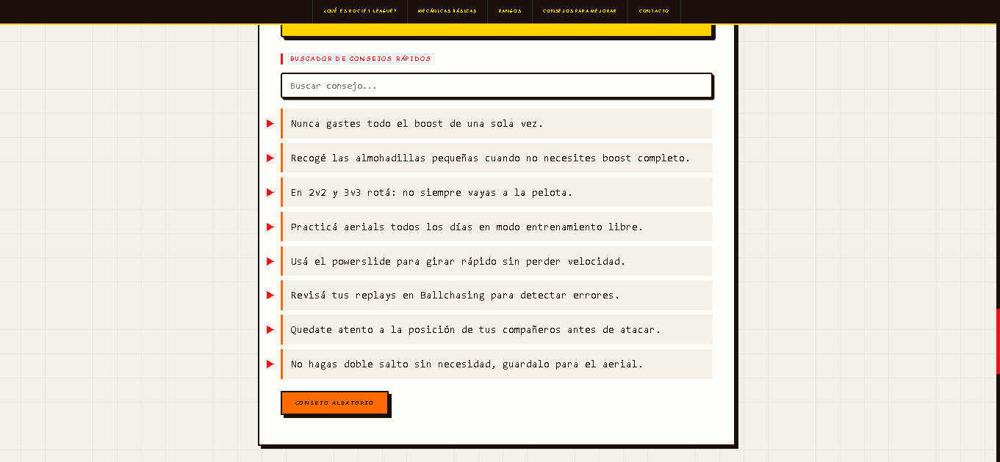

# Guía de Rocket League

## Descripción
Este proyecto es una página creada con HTML y CSS que funciona como guía para jugadores de Rocket League.
Fui separando las distintas etapas del proyecto en secciones para ir teniendo una mejor organización.
Incluye información base del juego, mecánicas, sistema de rangos y tips para mejorar.
También tiene un formulario de contacto al final para cualquier consulta o sugerencia.

## Contenido
- Menú principal con navegación
- Información general sobre el juego
- Mecánicas básicas y video tutorial
- Tabla de rangos competitivos
- Consejos para mejorar
- Formulario de contacto

## Tecnologías utilizadas
- HTML5
- CSS3 (Flexbox, Grid, animaciones, diseño responsive)
- JavaScript (funciones, eventos, arrays, DOM, validaciones)
- Google Fonts (Press Start 2P, Courier Prime)

## Mejoras visuales incorporadas
- Estética retro arcade con tipografía pixelada
- Variables CSS para colores y fuentes
- Animaciones de entrada en header, nav y secciones con @keyframes
- Layout Grid en sección de consejos
- Diseño responsive para tablet (768px) y mobile (480px)
- Efectos hover en navegación, tabla, inputs y botón
- Scrollbar personalizada

## Funcionalidades implementadas
- Buscador de consejos en tiempo real (filtra el array de consejos según lo que se escribe).
- Botón para mostrar un consejo aleatorio.
- Validación del formulario de contacto (campos vacíos, formato de email) con manejo de errores mediante try/catch.
- Mensajes de error y de éxito mostrados dinámicamente en el DOM.

## Enlace al repositorio
https://github.com/weedocainelli/TP_PAG

## Capturas
### Desktop

## Autor
Cainelli, Guido — UTN Reconquista — Programación III